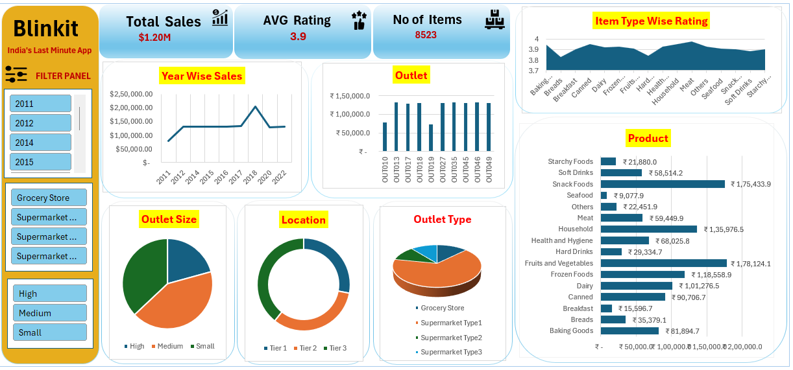

# Blinkit Sales Dashboard (Excel)

## Purpose
This project is an interactive sales dashboard built using Microsoft Excel (.xlsx) to analyze Blinkit grocery data.
It helps understand sales performance, product trends, and outlet analysis in a simple and visual way for better decision-making.

---

## Tech Stack
- Microsoft Excel (.xlsx) – Data cleaning, analysis & dashboard creation  

---

## Features & Highlights  
#Business Problem
Blinkit handles large amounts of sales data, making it difficult to:
- Track total sales performance  
- Analyze product-wise sales  
- Compare outlet performance  
- Understand customer preferences  
---
#Goal of the Dashboard
- Show all important data in one dashboard  
- Make data easy to understand using charts  
- Help in quick and better decision-making  
---
Walkthrough of Key Visuals
KPI Cards (Top Section)
- Total Sales  
- Average Rating  
- Number of Items  
- Provides a quick overview of business performance  
---
Year-wise Sales (Line Chart)
- Shows sales trend over time  
- Helps identify growth or decline  
---
  Outlet Performance (Bar Chart)
- Compares sales across different outlets
- Helps identify top-performing outlets  
---
Product-wise Sales (Bar Chart)
- Shows which products generate more sales  
- Helps identify best-selling items  
---
Outlet Analysis (Pie Charts)
- Outlet Size  
- Location  
- Outlet Type  
- Helps understand distribution of sales  
---
Filter Panel
- Year  
- Outlet Type  
- Outlet Size  
- Makes dashboard interactive  

---

### Business Impact & Insights
- Identify top-selling products  
- Understand outlet performance  
- Track sales trends over time  
- Improve business decision-making  

---
### Screenshot
https://github.com/suchita-chaudhari1996/Blinkit_Geocery_Project/blob/main/Blinkit_Geocery.png
## 📸 Screenshot

